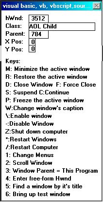



## WindowPeek V3\.0

### Description

WindowPeek Version 3.0 is a window spy, but it also has a lot more to it! As well as getting the class, hwnd, caption, parent, and xy position of any window you put the mouse over, Window peek also has the option to minimize, restore, close, force close, freeze and unfreeze(Use the same key for both) a window, change the caption of the window, enable and disable the window(Equivalent to the VB enable command, but on any window), shut down or restart the computer, change the attributes of the window's menus, scroll the contents of the window, change the window's parent, find a window by it's hwnd or title, and it even has a test window, so you can try all of the functions without doing anything to your other windows! A must see!
 
### More Info
 
In VB 4.0 32 bit or higher, this will need some porting, as all API calls are 16 bit.

             |
---                |---
**Submitted On**   |2000-06-25 12:29:34
**By**             |[Michael Barnathan](https://github.com/Planet-Source-Code/PSCIndex/blob/master/ByAuthor/michael-barnathan.md)
**Level**          |Advanced
**User Rating**    |5.0 (10 globes from 2 users)
**Compatibility**  |VB 3\.0, VB 4\.0 \(16\-bit\), VB 4\.0 \(32\-bit\), VB 5\.0, VB 6\.0
**Category**       |[Windows System Services](https://github.com/Planet-Source-Code/PSCIndex/blob/master/ByCategory/windows-system-services__1-35.md)
**World**          |[Visual Basic](https://github.com/Planet-Source-Code/PSCIndex/blob/master/ByWorld/visual-basic.md)
**Archive File**   |[WindowPeek100565712002\.zip](https://github.com/Planet-Source-Code/michael-barnathan-windowpeek-v3-0__1-9217/archive/master.zip)

